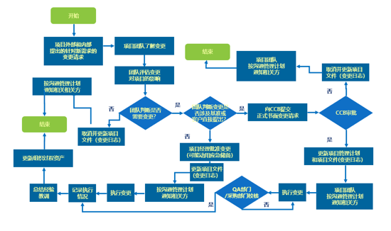
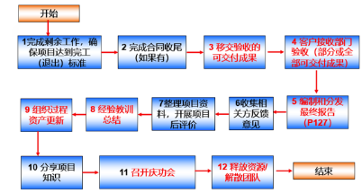
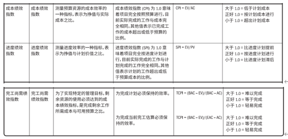
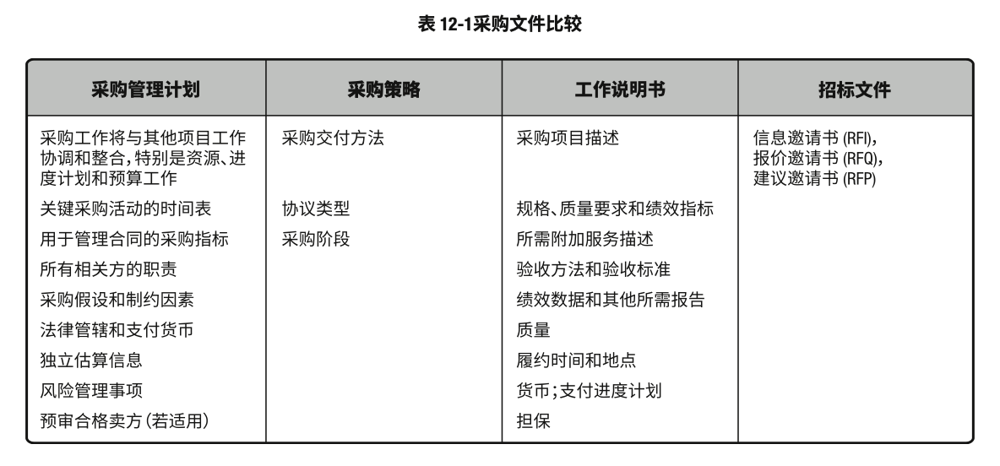

### 1. 引论  
项目的定义：  

项目是为了创造某项独特产品、服务或成果所做的临时性工作  
- **临时性**：有明确的开始时间和结束时间  
- **独特性**：产出物在一定程度或者某些方面与其他产品或服务相比较有明显差别  

项目驱动变革、项目创造商业价值（项目是一种投资）  
- 有型收益： 货币资产、股东权益、固定设施、工具、市场份额等  
- 无形收益： 商誉、品牌认知度、公共利益、战略一致性  

战略、项目组合 (portfolio)、项目集(program)、项目(project)  
产品的生成销售环节就是运营，用来体现项目价值  

产品的开发阶段就是研发   

项目组合，项目集合项目的区别  
- 项目组合中的项目或项目集不一定彼此依赖或有直接关系（关键字：**无内在联系，共享资源，战略目标**）  
- 项目集是一组相互关联且被协调管理的项目、子项目集、活动。协调管理是为了获得分别管理所无法实现的收益（关键字：**项目之间有内在联系**）。  
- 项目组合可以包含**运营**，项目集和项目不包含运营  

项目生命周期按顺序排列，有时又相互交叉的各个项目阶段集合  
项目生命周期：  

- 预测型（瀑布型）  
- 适应型（敏捷型）  

开发项目周期（针对做产品）：  
- 预测型  
- 迭代型  
- 增量型  
- 适应型  
- 混合型  

迭代 VS 增量：  
迭代一般有大的框架了  

敏捷型（Agile）是迭代+增加的组合  
所有需求都往Product Owner提，然后生成Product Backlog  
Daily Scrum Meeting 站会  
Sprint Review是在一个Sprint结束后开的会议（回顾会议）

项目生命周期是阶段，项目管理是过程   
**每个生命周期**的阶段都包含5个过程组  

项目是有阶段的，项目管理是没有阶段，只有过程。  
所有的项目管理过程都是5个：启动，规划，执行，监控，收尾。  

项目生命周期4个阶段 CDEF  
- Conception  
- Design  
- Execute  
- Finish  

ITTO, input, tool, technology, output  
49个子过程   
阶段之间是阶段关口，Gate，需要评审，milestone不需要评审  

### 2 项目运行的环境  
事业环境因素：  
- 指项目团队不能控制的，将对项目产生影响、限制或指令作用的各种条件。  
- 可以来自组织内部或者外部  
- 提高或限制项目的灵活性，对项目结果产生积极或消极的影响  
- 是大多数规划过程的输入  
- 牵涉到**限制**和**指令**的都是事业环境因素  
- **获取资源**、**建设团队**和**管理团队**三个管理过程会导致事业环境因素的更新   

PMIS（信息技术软件）

资源获取

组织过程资产：  
- 所有与过程相关的资产  
- 来自参与项目的所有组织  
- 对项目成功有帮助  
- 是许多项目管理过程的输入
- 团队成员有责任做贡献，资产多少体现组织成熟度  

**合格供应商清单**可以成为组织过程资产，如果供应商不符合公司合格要求，这个就成为了事业环境因素  

组织结构形式：  
- 职能型组织： 人员按专业分组 
- 项目型组织：团队成员通常集中办公，组织大部分资源都用于项目工作，项目经理拥有很大的自主性和职权  
- 矩阵型组织：  
  - 1.弱矩阵型：有个项目协调员，保留了职能型组织的大部分特性   
  - 2.平衡矩阵型：承认了全职项目经理   
  - 3.强矩阵型：在强矩阵型里会出现PMO，项目经理是专职的，职权被进一步放大（**不能等同于紧密式矩阵**）  
- 紧密型矩阵不属于组织结构类型  

PMO:  
- 支持型：这种类型的PMO其实是个项目资源库  
- 控制型：会要求项目服从（方法论）   
- 指令型：直接管理和控制项目  

### 3 项目经理的角色  
- 项目经理是由执行组织委派，领导团队实现项目目标的个人  
- 职能经理是对某个职能业务单元提供管理监督（职能经理有责任提供经培训，合格的资源）  
- 运营经理是保证业务运营的高效性  

项目经理的能力框架 PMI人才三角  
- 技术项目管理  
- 战略和商务管理  
- 领导能力  
管理是用正确的方法做事，领导是做正确的事情  

项目经理权利：  
- 地位  
- 信息  
- 参考 （因为他人的尊重和赞赏，获得信任）  
- 情境  
- 个性或者魅力  
- 关系  
- 专家 （基于以往经验和专业知识）  
- 奖励相关的  
- 处罚或者强制力  
- 迎合  
- 施加压力  
- 出于愧疚  
- 说服力  
- 回避  

领导力风格：  
- 放任型（允许团队自主决策和设定目标）  
- 交易型 （关注目标，反馈和成就以确定奖励）  
- 服务型 （作出服务承诺，处处为他人着想；关注他人的成长，学习，发展，自主性和福祉；关注人际关系，团体合作；服务优先）  
- 变革型 （通过理想化特质和行为，鼓舞性，促进创新和创造，个人关怀，提高追随者能力）  
- 魅力型 （激励他人;精神饱满，热情洋溢，充满自下；说服力强）  
- 交互型 （结合了交易型，变革型和魅力型）  

执行：  
- 过程层面的整合  
- 认知层面的整合  
- 背景层面的整合  

整合与复杂性：  
复杂性有3个维度组成  
- 系统行为  
- 人类行为  
- 模糊性  

### 4 项目整合管理  
项目发起人（Sponsor） 章程由项目发起人发布，并任命项目经理   
项目整合管理由**项目经理**负责  

7个过程：  
- 制定项目章程（**不修订，不变更**批准项目，授权项目经理，使用组织资源；仅开展一次；建立组织内部合作关系，外部关系由合同达成合作协议）   
- 制定项目管理计划（是方法和策略，生成一份综合文件，仅开展一次）  
- 指导与管理项目  
- 管理项目知识 （关键活动：知识分享和知识整合，显性知识和隐性知识）  
- 监控项目工作  
- 实施整体变更  
- 结束项目或阶段  
- 
项目由项目以外的机构来启动， 如发起人，项目集或项目管理办公室，项目组合治理委员会。 发起人一般是高管。  

#### 4.1 制定项目章程  
也叫立项报告  
输出  
- 项目章程（后续不变更）  
- 假设日志  

重要输入  
- 商业文件
 - 商业论证（必要性和核算，可**变更**，有备选方案）  
 - 效益管理计划  
- 协议（合同是协议的一种）  

**项目经理**负责了解交付项目商业价值所要求的紧迫性。  
项目发起人确定紧迫性，但项目经理负责根据推动商业价值实现的紧迫性交付项目。  
紧迫性是主观存在的，由项目发起人确定。  

成功标准在项目章程里说明  
项目章程里描述了业务需求

假设 VS. 制约因素  
- 制约因素是可观存在，必须遵守，不然会造成麻烦。
- 假设条件是指在制定计划时，不需验证即可视为正确、真实或确定的因素。
- 两者最大的区别是：制约因素是**确定的、客观存在**的，而假设条件是**当前不能确定**的

**商业论证要定期审核**  

12个子计划+4个基准+3个其他  

德尔菲法：  
问题专家匿名参与其中，设计调查表反复征询专家意见  
有助于减轻数据的偏倚  
项目4大目标（范围，时间，质量，成本）  

#### 4.2 制定项目管理计划   
输出  
- 12个子计划  
  - 范围管理计划  
  - 需求管理计划  
  - 进度管理计划  
  - 成本管理计划  
  - 质量管理计划  
  - 资源管理计划  
  - 沟通管理计划  
  - 风险管理计划  
  - 采购管理计划  
  - 相关方参与计划  
  - 变更管理计划  
  -  配置管理计划  

- 4个基准  
  - 范围  
  - 进度（制定进度计划）  
  - 成本（制定预算）  
  - 绩效测量  
  
- 3个其他  
  - 项目生命周期  
  - 开发方法  
  - 管理审查  

项目管理计划确定之后就是确定计划的基准。  

#### 4.3 指导与管理项目工作  
主要输出：  
- 可交付成果  
- 工作绩效数据  

#### 4.4 管理项目知识  
关键活动：  
- 知识分享  
- 知识整合  

重要输出：  
- 经验教训登记册  

经验教训在项目全阶段都可以总结  
经验教训登记册是文件，它可以放到经验教训知识库，但不是全部都放  
经验教训知识库 = 组织过程资产  

#### 4.5 监控项目工作  
重要输出：  
- 工作绩效报告  
工作绩效数据是指导与管理项目工作（子过程）的输出  

数据分析  
- 挣值分析（EVA） 挣值分析法（EVM） 
- 偏差分析  
- 趋势分析  
- 根本原因分析  
- 备选方案分析  
- 成本效益分析  

决策  
- 一致同意  
- 大多数同意  
- 相对多数原则  

监督：了解； 控制：纠偏   

#### 4.6 变更控制流程  
从全局整合的角度考察变更，降低变更对项目目标的  

- 变更提出  
- 影响评估  
- 变更批准  
- 文档更新  

当变更被批准后，你总是需要更新基准，然后再实施变更。这样一来，你就可以确保根据新的范围和进度预期，而不是旧的范围和进度预期，跟踪你的绩效。  

- 项目经理负责确保采取纠正行动。
- 变更请求带来的是变更，而不是纠正行动。
- 但是，纠正行动可能会带来变更请求。

变更提出必须书面记录（可以口头提出），并纳入变更管理和配置管理  
变更可有3种结果：**批准，否决，推迟**  
变更批准的责任通常是项目发起人、项目经理  
某些特定变更（往往是影响基准的变更）需要CCB批准 （CCB = Change Control Board），有些还需要得到客户或者发起人的批准  
**项目经理**对项目变更控制承担最终责任，以及**确定变更优先级**  

配置控制重点关注可交付成果及各个过程的技术规范（而变更控制则侧重于对项目变更的识别，记录和控制）  
- 识别配置项  
- 记录并报告配置项状态  
- 进行配置项核实与审计  

#### 4.7 结束项目或阶段  
重要输出：
- 最终产品、服务或成果移交
- 最终报告（范围目标，质量目标，成本目标，进度目标）  

项目收尾=行政收尾  

收尾所需必要活动  
- 所有规定的交付物得到客户验收、所有问题得到解决  
- 交付物均已移交客户 （异常终止只移交，不验收，并记录终止原因）  
- 为关闭合同必须展开活动  
- 为总结经验教训所必须做的事情  

撰写最终报告，要在重新分配项目人员之前，以及组织流程资产更新之前。  

交付物一定要先验收后移交  
异常终止只移交不验收，不过要先记录终止的原因，再一起移交  

可在本过程更新所有项目文件，并标记为最终版本  
经验教训登记册的最终版本要包含阶段或项目的最终信息  

### 5.项目范围管理  
做且只做所需的全部工作  
定义和控制工作哪些包含在项目内，哪些不包含在项目内  

要知道项目的scope 和 out of scope  
内部原因造成的范围蔓延——镀金  
外部原因造成的范围蔓延——范围潜变  

#### 5.1规划范围管理  
范围包含2种含义  
- 产品范围（根据产品需求来衡量）  
- 项目范围（根据项目管理计划来衡量）  

输出：  
- 范围管理计划  
- 需求管理计划  

WBS = Work Breakdown Structure  

范围管理计划和需求管理计划只是如何做范围和需求管理的计划，例如范围管理计划包括项目范围说明书的格式和WBS层级结构的说明。需求管理计划是针对如何收集需求的计划，不涉及记录和同意项目的工作和它将产生出什么的相关内容  

#### 5.2收集需求  
需求有需要和期望：需要是必须完成，期望是最好完成  
需求：已量化且书面记录，详细探明  

工具和方法：  
- 头脑风暴 （短时间获得大量创意）  
- 访谈（获得机密信息）  
- 焦点小组 （针对焦点问题达成一致）  
- 名义小组（做排序）  
- 问卷调查 （受众广）  
- 标杆对照（绩效跃进）  

数据表现  
- 亲和图  
- 思维导图  

输出：  
- 需求文件（详细记录的文档）  
- 需求跟踪矩阵（RTM）（一个表格，谁提的，什么时候提的等等）  

### 5.3 定义范围  
常用工具  
- 头脑风暴  （短时间获取大量信息）  
- 观察 (有助于挖掘隐藏需求)  
- 横向思维（水平思维）  

输出  
- 项目范围说明书  
- 项目文件更新  

### 5.4 创建工作分解结构  
输出  
- 范围基准 （包括：项目范围说明书，WBS，WBS词典-即WBS属性）  
- 项目文件更新  

WBS词典：  
- 账户编码标识  
- 工作描述  
- 负责的组织  
- 进度里程碑  
- 相关的进度活动  
- **所需资源**  
- **成本估算**  
- **质量要求**  
- **验收标准**  
- 技术参考文献  
- 协议信息  

WBS组织并定义了项目的总范围（**不是范围说明书，WBS更细，包含交付成果和如何实现**）  

工作包（work package）是WBS最底层工作，便于资源分配和成本、时间估算  
工作分解程度取决于所需控制程度  
敏捷项目的工作包层是用户故事  

分解步骤：  
- 1.识别和分析可交付成果及相关工作  
- 2.确定WBS的结构和编排方法  
- 3.自上而下逐层细化分解 （如采用敏捷方法，可以将长篇故事分解成用户故事）  
- 4.为WBS组成部分制定和分配标识编码  
- 5.核实可交付成果分解的程度是否恰当  

如果项目中的一部分分包给第三方，那么这部分的工作由第三方完成WBS，作为整个项目WBS的一部分  

分解程度取决于所需的控制程度  
难度大的越细分越容易做成功  

控制账户：工作包的大类，一个工作包只属于一个控制账户  

### 5.5 确认范围  
就是在验收交付物  
先做质量验收，再做范围验收  

输出：  

- 验收的可交付成果 （其实是质量验收，客户或发起人正式签字批准）  
- 工作绩效信息  
- 变更请求  
- 项目文件更新  

可交付物的过程：  
1. 可交付物（4.3输出）  
2. 核实的可交付物（质量验收 5.5输入）  
3. 验收的可交付物（范围验收 5.5输出）  

### 6 项目进度控制  

### 6.1 规划范围管理  
输出：  
进度管理计划  
- 项目进度模型制定  
- 进度计划的发布和迭代长度  
- 准确度  
- 计量单位  
- 组织程序链接  
- 项目进度模型维护  
- 控制临界值  
- 绩效测量规则  
- 报告格式  

输入：  
项目章程  
项目管理计划：范围管理计划 + 开发方法（敏捷 or 瀑布）  

### 6.2 定义活动  
识别和记录为完成项目交付成果而采取的具体行动的过程  
将工作包分解为进度活动  
本过程需要在整个项目期间展开  

输出：  
- 活动清单 （基于工作包继续分解出来的）  
- 活动属性 （也需要渐进明细） 
- 里程碑清单 （持续时间为0）  
  - 强制性里程碑  
  - 可选性里程碑  
- 变更清单  
- 项目管理计划更新  

详细规划近期，粗略规划远期 ——滚动式规则（渐进明细）  

甘特图没有逻辑关系，网络图有逻辑关系，Project里是甘特逻辑图  

### 6.3  排列活动顺序  
排列的是**逻辑顺序**  
除了首尾两项，每项活动都至少有一项紧前活动和一项紧后活动，并且逻辑关系适当  

主要输出：  
- 项目进度网络图（项目进度活动之间的逻辑关系）  

AON（Activity on Node） = PDM（Precedence Diagramming Method 紧前关系绘图法） = 单代号 (节点表示任务，箭线表示关系)  
最常见的逻辑关系是完成到开始

AOA（Activity on Arrow）= ADM（Arrow Diagramming Method 箭线绘图法） = 双代号 (节点表示关系，箭线表示任务，虚线表示虚任务，哑任务，建筑行业用的多)  

紧前关系绘图法（关键路径法CPM中使用这种绘图法）  
活动之间4中关系  
- FS（最常用）  
- SS  
- FF  
- SF (交接班，较少用)  

提前量（-）  
滞后量（+）  

执行确定和整合依赖关系：  
- 强制性依赖关系  
- 选择性依赖关系（又称软逻辑，可考虑调整或删除，从而进行快速跟进）  
- 外部依赖关系  
- 内部依赖关系  

### 6.4 估算活动持续时间（工期）  
输出：  
- 持续时间估算  
- 估算依据  
- 项目文件更新  

类比估算：粗略，早期，快速  
参数估算：模型可靠，数据库，统计  
三点估算：最可能时间（tM）, 最乐观时间（tO）, 最悲观时间（tP), 期望持续时间（tE）  

- 三角分布 tE = (tM + tO + tP) / 3 ，针对单个活动  
- 贝塔分布 PERT技术 tE = (4tM + tO + tP) / 6，标准差 (tP - tO) / 6 题目未明确表示三角分布用这个公式，针对单个活动  
- 正态分布，针对单个活动在哪个时间段完成概率（ EV±SD = 68.26%， EV±2SD = 95.44%，  EV±3SD = 99.72%）  

工具：  
- 自下而上  
- 备选方案  
- 储备分析  
  - 应急储备——针对已知风险，加在活动上，也可以加在总项目上  
  - 管理储备——针对未知风险，不包含在基准里，只能加在总项目上  
- 决策  
- 会议  

总浮动时间是0的任务就是关键路径上的任务  
总浮动时间是负数代表项目延期  
每条路径上的工期总和最大就是关键路径  

自由浮动时间 = min(后续活动最早开始时间 - 本任务最早完成时间 - 1) 

### 6.5 制定进度计划  
主要输入  
- 范围基准  
- 活动属性  
- 估算依据  
- 持续时间估算  
- 资源日历（如开发人员的请假）  
- 风险登记册  
- 协议  

主要输出  
- 进度基准  
- 项目进度计划  
- 进度数据  
- 项目日历（一个项目上可以有多个不同日历）  

主要工具：
- 进度网络分析  
- 关键路径法（CPM，前提是项目的资源是充分的）  

数据分析  
- 模拟（常用为蒙特卡洛分析，完工日期概率图）  

工具  
- 资源优化：  
  - 资源平衡：解决资源供需不匹配问题，处理结果可能导致工期延长  
  - 资源平滑：解决预定资源工作量分布不均，处理结果不延长工期（尽量减小资源负荷的变化，资源线条波动小）  

- 进度压缩  
  - 前提：不缩减项目范围，不降低项目质量  
  - 关键路径分析中，如果总浮动时间是负值，意味着需要进度压缩   
  进度压缩两种方法：  
  预算充足用**赶工**（也就是会产生额外费用）  
  不充足用**快速跟进**（但会产生风险）  

范围基准：范围说明书 + WBS + WBS词典  
进度基准：每个活动的计划开始时间，计划结束时间（用于实际工期比对）   
成本基准：按时间段分配的经过批准的预算  
未来时期的业务费用被视为**持续费用**，不属于项目费用  

### 6.6 控制进度  
主要输出：  
- 进度预测  

### 7 项目成本管理  
全生命周期成本  
- 前期成本  
- 建设成本  
- 使用成本  
- 弃置成本  

### 7.1 规划成本管理  
备选方案分析  
- 项目筹资方案  
- 筹集项目资源的方法  
主要输出： 成本管理计划，包括：  
- 计量单位  
- 精确度级别  
- 准确度  
- 组织程序的链接  
- 控制临界值  
- 绩效测量规则  
  - 是否使用EVM  
  - 确定WBS的控制账户  
  - EV的度量方法  
  - 计算EAC（完工预测）的公式  
- 报告格式  

### 7.2 估算成本  
项目启动阶段：粗略估算ROM -25% ~ +75%类比估算  
随着信息的丰富：确定性估算 -5% ~ +10%自下而上估算  
主要输出：  
- 成本估算  
- 估算依据  

主要输入：  
- 成本管理计划  
- 质量管理计算  
- 范围基准  
- 资源要求  

质量的要求越高，成本就越大  

### 7.3 制定预算  
项目预算 = 成本基准 + 管理储备  

主要输出：  
- 成本基准 （活动预算 + 应急储备）  
- 项目资金需求  

资金限制平衡：根据项目资金划拨的限制，对项目活动的成本花费进行调整。（资金影响项目进度计划）  
融资  

### 7.4 控制成本  
监督项目状态，识别偏差， 管理成本基准变更  
主要输出：  
- 工作绩效信息  
- 成本预测  
  
#### 挣值分析  
EVA = EVM  
EVA把范围基准，成本基准和进度基准整合起来，形成绩效测量基准。  
针对每个工作包和控制账户，计算并检测以下三个关键指标（3S曲线）：  
- PV（计划价值）  
- EV（挣值，已完成工作的经批准的预算）  
- AC（实际花费）

偏差分析  
SV (schedule ) = EV - PV; SV > 0 进度超前，SV < 0 进度落后  
CV (cost) = EV - AC；CV > 0 成本节省，CV < 0 成本超支  

SPI (schedule performance index) = EV/PV; SPI > 1 表示进度提前  
CPI (cost performance index) = EV/AC; CPI > 1 表示成本节省  

关键路径的SPI会影响项目总进度
项目CPI不受关键路径的CPI < 0 所影响I

趋势分析：  
- 完工预算 BAC（Budget At Completion，按时间段划分的，最大成本基准）  
- 完工估算 EAC （Estimate At Completion）  
- 完工尚需估算  ETC（Estimate To Completion）  
- 完工差异 VAC （）  

完工差异 = 完工预算 - 完工估算  
VAC = BAC - EAC （VAC > 0，未来项目在预算可控内）  

EAC 4种算法（趋势分析）:  
- EAC = AC + (Bottom-Up) ETC = 当前的实际成本 + 剩余工作的全部自下而上的成本估算 （实际项目中比较难算ETC）
- EAC = AC + (BAC - EV) = 当前的实际成本 + 剩余工作的原预算（非典型偏差，假设今后的工作可以按原计划完成）  
- EAC= AC + (BAC -EV)/CPI = BAC/积累CPI = 当前的实际成本 + 剩余工作的预算/CPI (典型偏差，假设以当前CPI完成ETC工作)  
- EAC = AC + (BAC - EV)/(CPI * SPI) = 当前的实际成本 + 剩余工作的预算/(CPI * SPI) （典型偏差，假设SPI与CPI将同时影响ETC工作）  

TCPI（完工尚需绩效指数TCPI）  
TCPI < 1，说明完工所需的绩效指数低，工作难度低  

TCPI(BAC) = 剩下的工作量 / 剩下的钱 =（BAC - EV）/ (BAC - AC)  
TCPI(EAC) = 剩下的工作量 / 剩下的钱 =（BAC - EV）/ (EAC - AC)  

公式：p267 

### 8. 质量管理  

项目质量：管理的质量  
产品质量：交付物的质量  

- 属性抽样：合格或不合格  
- 变量抽样：合格程度  

质量管理的5个级别（递进）  
- 客户发现缺陷  
- 自己检测出缺陷  
- 改进流程，让不出错  
- 把质量提前到规划和设计，让不能出错  
- 全员质量文化  

**管理质量VS.控制质量**  
- 管理质量针对过程，主要用于过程改进  
- 控制质量针对产品，做产品纠错  
- 如果**一个可交付成果**质量有问题，则要在控制质量过程中解决  
- 如果**多个可交付成果**质量有问题，则要在管理质量过程中解决  

#### 8.1 规划质量管理  
主要输出:   
- 质量管理计划（包含了质量目标和标准，质量角色与职责，质量工具等等）  
- 质量测量指标  

主要工具：  
成本效益分析（质量并不是越高越好）  

质量成本：  
- 一致性成本（主要是预防）  
  - 预防成本（培训）  
  - 评价成本（测试）  
- 非一致性成本（处理失败）  
  - 内部失败成本（团队检测出）  
  - 外部失败成本（客户检测出）  

EMV(Expect Money Value) 期望货币值  

SIPOC  

L，T，X，屋顶型矩阵（质量屋）  

####  8.2 管理质量  
质量管理就是你要通过检查来发现工作产品的问题。  
管理质量是指你在研究你的流程对你所做的工作的质量有何种影响。  
管理质量 > 质量保证 范围定义更广  
管理质量还包括**过程改进，产品设计**  

敏捷项目中，质量管理由所有团队成员执行  
传统项目中，质量管理是由特定团队成员执行  

主要输出：  
- 质量报告  
- 测试与评估文件  

最常用于分析和评估改进机会的2种质量改进工具  
- 计划-实施-检测-行动 PDCA（A最重要）  
- 六西格玛：DMAIC是指定义，测量，分析，改进，控制五个阶段构成的过程改进方式   

亲和图：分类管理  
流程图：描述步骤，记录每个节点发生的问题，也可能有助于了解和估算质量成本  
矩阵图：从多个维度分析问题，质量指标之间相关性强弱（类似checklist）  
因果图（鱼骨图，石川图）：分析引起问题或偏差的**根本原因 Why-Why How-How**  
直方图：统计产生问题原因的数量  
帕累托图（特殊直方图）：2/8法则，可以找到**主要原因**  
- A 类 主要因素  
- B 类 次要因素  
- C 类 一般因素  
散点图：判断两个变量间是否有相关性  
控制图：用来确定一个流程/过程是否稳定，是否达到预期的绩效，有3条线，平均线，上控制线，下控制线  
过程失控：  
1. 超过上下限  
2. 连续**7个点**落在均值上方或者均值下方  

客户声音：规格上下限  
系统声音：控制上下限  

#### 三大审计  
- 质量审计（只是对过程审计，并不对成果质量进行审查，管理质量过程的工具与技术）**项目已完成也可以做质量审计**  
- 风险审计（用于评估风险管理过程的有效性，在监督风险过程）  
- 采购审计（对合同和采购过程的完整性、正确性和有效性进行的审查，在控制采购过程）  

#### 8.3 控制质量  
满足用户验收和最终交付质量  

主要输出：
- 质量控制测量结果  
- 核实的可交付成果  
- 工作绩效信息  

核查表（check sheet）：有效收集潜在质量问题的相关数据（来自控制质量）  
核对单（checklist）：核实一系列步骤是否执行（来自管理质量）

统计抽样  
- 属性抽样（是否满足要求，结果是：符合/不符合）  
- 变量抽样（生成控制图）  

检查是指检验工作产品，以确定是否符合书面标准

质量审查重点找出你在项目上做的哪些效率低下或导致缺陷的东西，从而帮助你提高工作效率。当发现这些问题时，需要采取纠正措施来解决这些问题，当然，前提是需要提出变更请求。

### 9资源管理  
搭班子，定规则，带队伍，管冲突，提绩效。  
自组织团队（敏捷环境）  

#### 9.1 规划资源管理  
主要输出：  
- 资源管理计划（团队成员目标工作）  
- 团队章程（做事原则，价值观，沟通指南等）  

在团队章程中定义的**基本规则**规定了项目团队成员以及其他相关方在相关方参与方面的预期行为。  

数据表现：  
- 层级型（高层级，WBS/OBS/RBS）  
- 矩阵型（关系）  
- 文本型（记录详细）  

组织分解结构（OBS）是根据一个组织现有的部门、单元或团队来安排的，要列出每个部门下的工作包的项目活动  

详细职责用文本型来描述  

RAM（责任分配矩阵）矩阵 图，每个任务只能有一个A  
RACI矩阵是RAM的一种表现形式，用于避免职权不清（特别是团队由内部和外部人员组成）：  
- R 负责 responsible
- A 执行/问责 accountable
- C 咨询 consulted
- I 知情 informed

资源管理计划  
- 识别资源  
- 获取资源  
- 项目组织图  
- 角色与职责  
- 项目团队资源管理  
- 培训  
- 团队建设  
- 认可/奖励计划  
- 资源控制  

团队章程  
- 团队价值观  
- 沟通指南  
- 决策标准和过程  
- 冲突处理过程  
- 会议指南  
- 团队共识  

#### 9.2 估算活动资源  
主要输出：  
- 资源需求  
- 估算依据  
- 资源分解结构（RBS）  
  - 资源类别  
  - 资源类型  

人力资源  
实物资源  

#### 9.3 获取资源  
获得资源，并将其分配给相应的活动  
- 内部资源从职能经理或资源经理那获得  
- 外部资源通过采购/租赁获得  

主要输出：  
- 物质资源分配单  
- 项目团队派工单  
- 资源日历（某个资源的可用时间）  

光环效应（Halo Effect）成见效应 晕轮效应  

谈判（主要和以下3方谈判）  
- 职能经理  
- 执行组织中的其他项目管理团队  
- 外部组织和供应商  

预分配（预分派）是获取资源流程中的一种工具和技术。  
场景：  
- 招投标/采购合同中确定了具体人选  
- 项目对人员资质有特殊要求  
- 项目章程中确定了具体人选  

作为项目建议书一部分内容而承诺的资源应在项目章程中注明。  
预分配涉及的可以是**人力资源**或**实物资源**。  
作为项目建议书一部分内容而承诺的团队成员应在项目章程中注明  

#### 9.4 建设团队  
主要目的：以提高项目绩效为目的  
主要输出：  
团队绩效评价  
指标有：  
- 个人技能改进  
- 团队能力改进  
- 团队成员离职率降低  
- 团队凝聚力加强  

团队发展5阶段模型（塔克曼阶梯理论）  
- 形成阶段 （相互独立，指导式）  
- 震荡阶段 （出现冲突，教练式）  
- 规范阶段 （相互信任，参与式）  
- 成熟阶段 （相互依靠，委任/放任式）  
- 解散阶段 （相互留恋，咨询式） 

通常按照顺序  
有时候团队陷入某个阶段，不能向前（特别是震荡阶段）  
有时又退回到前面阶段（进入新人，直接退到形成阶段）  
有合作经验的团队可以直接到后面阶段（一般到规范阶段）  

工具：  
集中办公（紧密矩阵，与虚拟团队相对。张贴进度计划）  

马斯洛需求层次模型  
- 自我实现需要  
- 尊重需要  
- 社交需要  
- 安全需要  
- 生理需要  

双因素理论（赫兹伯格）  
- 激励因素  
- 保健因素  

期望理论（维克托弗鲁姆）着眼于三种关系  
- 努力-绩效关系  
- 绩效-薪酬关系  
- 吸引力  

X理论（军事化，多用于流水线）  
Y理论 （自律）  

认可与奖励  
如何奖励应在**资源管理计划**中说明  

#### 9.5 管理团队  
对人力资源的管理  
冲突管理  
- 建设性冲突  
- 破坏性冲突  

冲突解决：尽早，私底下，直接地，协作地解决  

冲突来源  
-资源稀缺  
- 进度优先级排序  
- 个人风格  

解决冲突的5种方式：  
- 强迫/命令 (win-lose 上级对下级)   
- 撤退/回避  
- 合作/解决问题/直面（win-win）  
- 缓和/包容/抚平 （强调一致性）  
- 妥协/调节（lose-lose 谈判）  

撤销：从潜在的分歧中撤退或退出。  
抚平：淡化或回避分歧的地方，强调一致的地方（暂时的解决方案，并不能真正解决冲突的根本原因）。  
妥协：讨价还价和寻找解决方案，给争端中的各方带来一定程度的满意度，其特点是一个礼尚往来的态度。  
强迫：以可能牺牲另一种观点为代价宣扬一种观点，通常以竞争和一输一赢为特征。  
对抗：直接面对冲突，其中涉及解决问题的方法，受影响的各方通过这种方法解决相互间的分歧。  

情商：识别，评估和管理个人/他人/团队情绪的能力  

冲突处理三个步骤：  
- 自行解决  
- 私下处理  
- 正式程序  

从内在（自我管理和自我意识），外在（关系管理）能力，从而提高个人情商  
团队情商提高有助于提高效率，降低离职率  
团队通过情商识别成员状态可以增进合作  

影响力  

#### 9.6 控制资源  
对实物资源的管理  

主要输出：  
- 工作绩效信息  

问题来源：  
- 组织内部  
- 组织外部  

解决问题步骤：    
- 1. 定义问题  
- 3. 识别根本原因  
- 4. 生成可能的解决方案  
- 5. 选择最佳解决方案  
- 5. 执行解决方案  
- 6. 验证解决方案的有效性  

定义问题-分析问题-解决方案-执行-总结

可以先从团队内部选派资源来解决问题,团队内无匹配或不具备相关能力,再从外部找顾问 或专家来解决  

在执行控制资源流程时，可以利用数据分析来评价用资源完成活动的替代办法，如替代资源。数据分析还包括进行成本效益分析、绩效审查和趋势分析。  

### 10 沟通管理  
明确沟通需求，制定沟通计划，高效闭环沟通，改进沟通质量  
项目经理大致会花70%~90%用于沟通  

梅拉宾原理——面对面沟通存在的三个基本因素：  
a. Words（词语 7%）  
b. Tone of voice （语气语调 38%）  
c. Nonverbal behavior (facial expression) （非语言行为 55%）  

沟通形式：  
- 书面形式  
- 口头形式 （口头表达不一定是非正式的，看场合）  
- 正式或非正式形式  
- 手势/举止  
- 媒体形式  
- 遣词造句  

#### 10.1 规划沟通管理  
主要输出：  
- 沟通管理计划  
- 相关方参与计划  

决定哪些信息与受众相关是计划沟通管理的一部分，不恰当的沟通计划导致信息传递的这种延迟。  
沟通管理计划记录了相关方的沟通要求  

计算沟通渠道  
n(n-1)/2 排列组合Cn2  
增加人员并不能一定提高工作效率  

沟通方法：  
- 交互（双向沟通，如会议，电话会议，视频会议）  
- 推式（写信，报告，电子邮件，传真）  
- 拉式（把信息集中在某个地方，招引人前来看）  

沟通技术  

沟通模型  
- 发送方  
- 接收方  

沟通风格评估  
常用于那些不支持项目的相关方  
可以先开展相关方参与评估，在开展沟通风格评估  

政治意识  
正式和非正式权利关系的认知  

文化意识  

相关方参与评估矩阵  
C: 当前状态  
D: 期望状态  

#### 10.2 管理沟通  
其实就是在执行沟通过程  

主要输出：  
项目沟通记录  

沟通技能：  
- 沟通胜任力  
- 反馈  
- 非口头技能  
- 演讲技能  

会议：  
- 准备并发布会议议程  
- 确保会议在规定的时间开始和结束  
- 确保适当参与者受邀出席  
- 切题不跑题  
- 处理会议中的期望，问题和冲突   
- 记录所有行动以及所分配的行动负责人  

#### 10.3 监督沟通  
主要输出：  
工作绩效系信息  

### 11 风险管理  
已经发生的消极风险常被称为问题  

用风险的期望值来衡量风险的严重程度  
Expected Value = Probability * Impact  

成本 & 工期  
应急储备：已知风险  
管理储备：未知风险  

风险态度:  
- 风险偏好  
  - 风险逃避者  
  - 风险中立者  
  - 风险热衷者  
- 风险临界值（阈值）  

**储备金分析**将剩余的应急储备金数额与项目任何时候剩余的风险数额进行比较，以确定剩余储备金是否充足。
**风险过期**时，相关的储备金会返还给组织。

组织风险通常包括：
- 时间、成本、范围目标不一致，
- 缺乏资金，
- 缺乏优先次序或优先事项的变化，
- 以及与本组织已开展的其他项目的资源冲突。

#### 11.1 规划风险管理  
主要输出：  
风险管理计划，其中包含风险分类（RBS）  

工具：  
概率和影响矩阵（用于风险定性分析，里面包含了风险和机会）  

对进度和成本的管理  

#### 11.2 识别风险  
整个项目期间展开  

项目发起人对识别风险可能有帮助，但是对应对风险作用不大  

主要输出:  
- 风险登记册  
- 风险报告  

工具：  
- 1. 头脑风暴  
- 2. 访谈  
- 3. 风险核对单（之前项目的问题库变为现在项目的风险库）  

根本原因分析  
假设条件和制约因素分析  
SWOT分析（strength weakness opportunity threat）：  
- 用于识别正面或负面风险  
- 优势到机会  
- 劣势到威胁  

识别单个风险： RBS  

识别整体风险：  
- PESTLE （政治，经济， 社会， 技术， 法律， 环境）  
- TECOP（技术，环境，商业，运营，政治）  
- VUCA（易变性，不确定性，复杂性，模糊性）  

#### 11.3 实施定性风险分析  
主要干2件事：
- 风险排序  
- 确定每个风险责任人  

定性风险分析：用来排序（对风险期望：概率x影响 排序）  
定量风险分析：对前几名的主要风险进行分析（对工期，成本的影响）  

定性分析是主观的

风险数据质量评估(准确性，可靠性)是进行定性风险分析的工具。  

#### 11.4 实施定量风险分析  
主要输出
- 风险报告（由于是对整体风险的评估）    

风险管理中，风险定量分析不一定要做，其他都必须要做  
要做的项目有如下特点：
- 大型或复杂项目  
- 具有战略重要性的项目  
- 合同要求进行定量分析的项目  
- 主要相关方要求进行定量分析的项目  
- 定量分析是评估所有的单个风险对项目整体的**综合影响唯一可靠的方式**  

数据分析：
- 蒙特卡洛模拟 (工期，成本估算。输入是估算成本的三点估算的随机数据，随机数据反复模拟，而非一种一次性计算项目成本的模拟技术)  
- 敏感性分析（龙卷风图）  
- 决策树（计算每条分支算出最优路径）  
- 影响图 （变量对结果的影响）  

#### 11.5 规划风险应对  
进度计划更新：风险应对产生的工作包添加到项目进度计划中  
威胁应对措施（未发生）：  
- 上报 （向PMO或者项目集汇报，超过项目范围或者项目经理权限）  
- 规避  （改变项目的执行方式，使风险不在是一个因素）  
- 转移 （支付承担方一定费用）  
- 减轻 （关键字：备选，备用方案，原型，两个合格供应商里选靠谱的）   
- 接受  

机会（未发生）  
- 上报  
- 开拓  
- 分享 （成立合资公司）  
- 提高  
- 接受  

机会中的开拓和提高区别：  
- 开拓是**确保**机会发生  
- 提高是使机会**尽可能**发生  

事件**发生了**采用应急应对策略  

应对计划 VS. 应急计划（预案）  
- 应对计划  风险**还没发生**的时候就采取措施，使风险不发生，比如减轻，转移，接受等等。
- 应急计划 风险是由预警的，**预警出现**的时候采取应对。应急计划是一种特殊的应对计划。

风险未发生：  
- 应对计划  
风险发生后：   
- 应急计划  PlanA  
- 弹回计划  PlanB  
- 权变措施 临时办法  

What if情景分析是用来评估项目进度在不利条件下的可行性，也就是说，分析如果Y情景所代表的情况发生了，该怎么办？这种方法用于编制应急和应对计划，以减轻不利条件的影响。  

成本收益分析：处理风险的花费和损失价值的对比  
多标准决策分析借助于决策矩阵  

#### 11.6 实施风险应对  
工具：  
- 影响力  

#### 11.7 监督风险  

主要：  
- 监督商定的风险应对计划的实施  
- 跟踪已识别风险  
- 识别和分析新风险  
- 风险审计：评估风险管理过程的有效性  

主要输出;  
- 工作绩效信息  
- 变更请求  

### 12 项目采购管理  
合同：  
- 合同  
- 订购单  
- 协议备忘录（MOA, Memorandum of agreement，意向，计划要做什么）  
- 服务水平协议（SLA）  

编制合同时准确地将具体风险分配给最有能力的一方  

合同类型  
- 总价合同（固定价格合同）  
  - 固定总价FFP (买方最喜欢，范围能说清楚，范围变更需要修改合同)   
  - 总价加激励费用FPIF （和成本+激励比会有个**总价**关键字，并且封顶有限制）  
  - 总价加经济价格调整FPEPA （一般是合同跨度数年 or 涉及货币很多种，用于抵消通货膨胀等）  
- 成本补偿合同（成本返还合同）  
  - 成本 + 固定费用合同CPFF （乙方最喜欢，需要很多审计工作，即要审核很多卖方的报销发票）  
  - 成本 + 激励费用合同CPIF（有比例）  
  - 成本 + 奖励费用合同CPAF    
- 工料合同T&M（单价合同，无法说明工作范围，但清楚需要什么资源，包括人力和物质资源）  

statement of work SOW  

成不补偿合同和工料合同都是**开口合同**  

站在买方立场，为了规避成本超支风险，合同优先顺序为：  
固定价格合同——>单价合同（工料合同）——>成本返回合同   
范围能说清楚 固定价格合同  
范围说不清楚但能说清楚所需资源类型 工料合同  
什么也说不清楚或者时间紧迫来不及准备详细工作说明 成本补偿+激励  

一个项目生命周期里可以产生多个合同生命周期  

采购文件比较:  

#### 12.1 规划采购  
- 记录项目采购决策  
- 明确采购方法  
- 识别潜在卖家  

PMBOOK里主体身份是甲方  

- 1.准备采购工作说明书(sow/psow)  
- 2.准备高层级的成本估算，制定预算  
- 3.发布招标广告  
- 4.确定合格卖方的名单  
- 5.准备并发布招标文件  
- 6.由卖方准备并提交建议书  
- 7.对建议书开展技术（包括质量）评估  
- 8.对建议书开展成本评估  
- 9.准备最终的综合评估报告（包括质量及成本），选出中标建议书  
- 10.结束谈判，买方和卖方签署合同  

主要输出  
- 采购管理计划  
- 采购策略  
- 招标文件（Request For Proposal ）  
  - RFI 信息邀请书（了解卖方信息）  
  - RFQ 报价邀请书 （了解价格）  
  - RFP 建议邀请书 （了解方案，包括总体价格，最正式）  
- 采购工作说明书（SOW，有时叫工作大纲TOR）  
  - 规格  
  - 所需数量  
  - 质量水平  
  - 绩效数据  
  - 履约期间  
  - 工作地点  
  - 其他要求
- 供方选择标准  
- 自制或外购决策  
- 独立成本估算（找第三方估算项目市场成本）  

市场调研
自制/外购分析（可用决策树工作）
- 投资回报率（ROI）**年平均**
- 净现值（NPV）越高越挣钱  
- 标前会议（与潜在投标人的信息交流，确定管理和监督采购的策略）  

招标文件的几个要点：  
- 便于潜在卖方作出准确，完整的应答  
- 便于卖方对卖方应答进行评价  
- 包括规定的应答格式，采购工作说明书，及所需的合同条款  
- 采购文件的复杂和详细程度应与采购的价值及相关风险相符  
- 采购文件即需要被足够详细的信息，以确保卖方作出一致且适当的应答，同时它又要有足够的灵活度，让卖方为满足相同的要求而提出更好的建议。  

采购工作说明书（PSOW， 类似项目章程）  
- 产品/交付物  
- 规格/需求  
- 数量  
- 质量要求，性能要求  
- 交付日期  
- 期望的工作地  
- 是否需要乙方提供绩效报告  
- 是否需要售后服务  

#### 12.2 实施采购  
主要作用：选定合格卖方并签署关于货物或服务交付的法律协议  
- 获取卖方应答  
- 选择卖方并授予合同  

主要输入：  
- 卖方建议书  

投标人会议——标前会  
评标委员在作出决策之前需要**管理层**决定   
make-or-buy decision 用决策树  

#### 12.3 控制采购  
争议的解决最好用谈判的方式  
采购审计  

### 13 项目相关方管理  
#### 13.1 识别相关方  
在制定项目章程之前  
主要输出：  
- 相关方登记册  
  - 身份信息  
  - 评估信息（需求，期望， 影响力等）  
  - 相关方分类（权力，利益）  

问卷和调查  
头脑风暴  
头脑写作(书面头脑风暴)  

权力：他拥有的职位权力（领导）  
利益：相关方对项目结果的关注程度（用户）  
影响：对项目成果的影响能力（老员工，民间领袖）  
作用：改变项目计划或执行的能力 （操作员）  

权力利益方格：  
不同应对方式  
重点管理（协作/合作） 权力**↑** 利益**↑**  
令其满意（咨询） 权力**↑** 利益**↓**   
监督（参与） 权力**↓** 利益**↓**  
随时报告（推式沟通） 权力**↓** 利益**↑**   

凸显模型：  
- 1. 权力  
- 2. 合法性  
- 3. 紧急程度  

潜伏的相关方（权力）  
可自己决定行动的相关方（合法性）  
苛刻的相关方（紧急程度）  
有支配权力的相关方（权力和合法性）  
危险的相关方（权力和紧急程度）  
依赖情况而决定行动的相关方（合法性和紧急程度）  
最关键的相关方（权力，合法性，紧急程度都有）  
非相关方（三者都无）  

相关方登记册属性  
- 基本信息  
- 评估信息  
- 干系人分类  

相关方登记册 VS. 相关方参与计划：  
- 相关方登记册只包含基本的相关方评估信息  
- 而相关方参与计划则包括确保项目成功的相关方参与战略

PMBook 思想是：考虑最终用户的利益  

#### 13.2 规划相关方参与  
用什么策略去管理相关方，是一个反复的过程  
主要输出：  
- 相关方参与计划（策略，常常与沟通管理计划一起出现）  

#### 13.3 管理相关方参与  
主要输出:  
- 变更请求  
- 项目管理计划更新（沟通管理计划，相关方参与计划）  

工具与技术  
基本规则（来自团队章程）  

#### 13.4 监督相关方参与  
主要输出  
工作绩效信息  

### 零碎汇总  
#### 各个分解结构：
- 工作分解结构：是以可交付成果为导向的工作层级分解， 工作分解结构定义项目的全部范围  
- 资源分解结构：是根据项目需要的资源类别和类型， 对资源进行分类的层级结构  
- 风险分解结构：是按风险类别来排列已识别风险的一种层级结构图， 类别的划分标准可以是风险所属的项目阶段或部位， 或者风险的共同原因  
- 组织分解结构：是对项目组织的一种层级描述， 可在每个部门下列出其所负责的工作包  

#### 问题(issue)VS.风险(risk)
- 已经识别的风险，风险发生还是风险，不是问题。针对未知-未知风险，发生才是问题。
- 已经识别的风险，记录在风险登记册中，风险发生，还是要查风险登记册的应对办法，不会去看问题日志
- 任何时候遇到问题，首先要做的就是努力找出问题的原因。在你弄清楚问题的根本原因之前，你不应该采取任何行动。
- 每当你遇到一个新的风险，你应该做的第一件事就是把它记录在风险登记册中。 
- 一旦你确定了风险，下一步你需要分析风险的影响和概率！这就是定性风险分析的作用。在你完成风险分析之前，你不应该采取任何其他行动。 
- 计划风险应对措施是制定备选方案和行动以增加机会并减少对项目目标的威胁的过程。接下来的过程是实施风险应对措施。 
- 风险登记册里的内容是越多越好，表示对项目未来认识更全面  
- 问题日志里的内容是越少越好，解决问题是非增值活动  

**工作绩效报告**是以下过程的输入：  
- 管理沟通  
- 管理团队  
- 监督风险  
- 实施整体变更控制  

**合同的复杂程度**将决定合同谈判的复杂程度  

相关方之间的冲突应始终以有利于客户的方式解决。  

在本题中，工作包层包含四个子项目，所以不会用来创建活动清单。活动清单将从工作包层创建，为每个子项目创建的每个WBS创建活动清单。

经验教训不应该用来记录员工的表现。但是，你可以记录遗漏的活动以及遗漏的原因，而不点名。  

可以通过访问已经识别的相关方的方式来识别其他项目相关方  
在相关方分析中收集到的要求需要是可量化的  

在没有充分分析各种选择的情况下改变预算或范围，或者只是简单地推进计划，在未来申请额外的资金，都是违反PMI道德准则的  

原型让项目团队能够在早期收集相关方的反馈，他们可以利用这些反馈逐步明确范围和要求。原型是产品的小规模版本，可以包括模拟或仿真。  

如果没有组织的质量方针，就应该为项目制定质量方针，没有质量方针就不应该继续进行。  

质量政策（质量方针）包括最高管理层正式表达的组织在质量方面的总体意图和方向。如果执行组织没有正式的质量政策，或者如果项目涉及多个执行组织，例如在一个联合企业中，项目管理小组必须为项目制定一项质量政策。然后，质量管理计划要说明如何执行质量政策。  

PTA （point of total assumption） 总体假设点/最高限价  

TODO：  
工作包层和活动清单  
人员职责（组织分解结构，人员配置）

